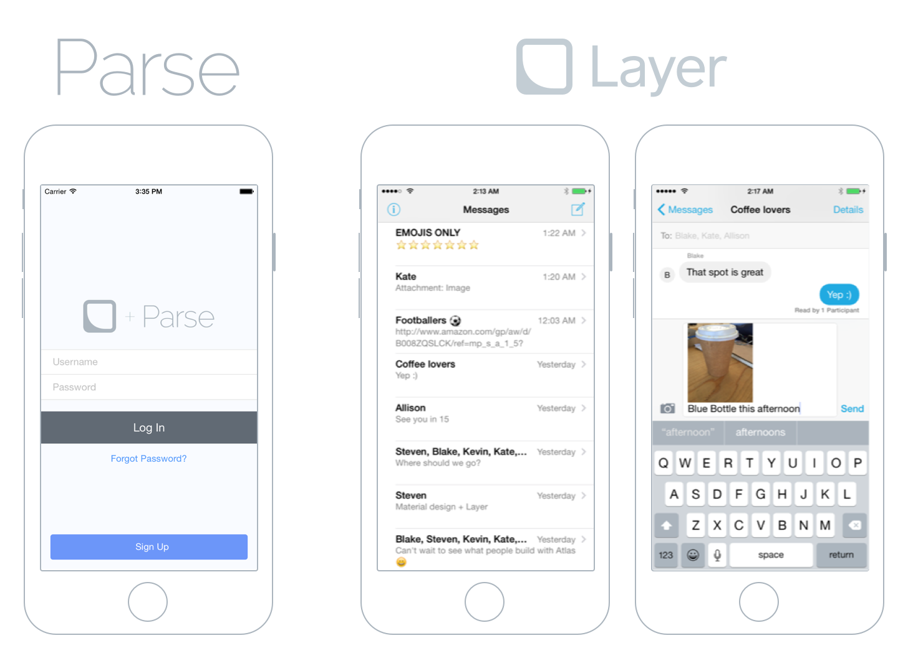
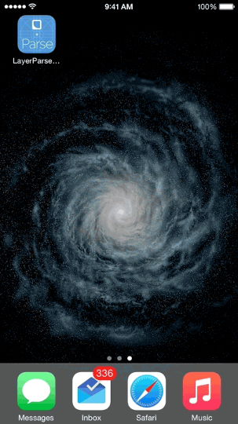

# LayerParseSampleApp

LayerParseSampleApp is a sample application highlighting how to integrate Layer with a [Parse](http://parse.com) backend. It presents a very simple example of a chat app.

## Requirements

This application requires Xcode and the iOS SDK v8.0. Dependencies are managed via [CocoaPods](http://cocoapods.org/) to simplify installation.

## Setup

1. Clone the project from Github: `$ git clone https://github.com/layerhq/LayerParseSampleApp.git`
2. Install the dependencies in the root directory via CocoaPods: `$ pod install`
3. Open `LayerParseSampleApp.xcworkspace` in Xcode.
4. Replace `ATLPLayerAppIDString` , `ParseAppIDString` , and `ParseClientKeyString` in `ATLPAppDelegate.m` with your Layer and Parse credentials.
5. Add the [Layer Parse Module](https://github.com/layerhq/layer-parse-module) to your Parse Cloud Code to serve as an authentication manager.
6. (Recommended) If you want test users, import the User.json file found under Supporting Files from the XCode project into your User class on Parse.
7. Build and run the application on your Simulator to create a new user and begin messaging!

## Highlights

* Uses [ParseUI](https://github.com/ParsePlatform/ParseUI-iOS) to authenticate and create new users.
* Demonstrates how to get identity tokens from Parse Cloud Code using the [Layer Parse Cloud Module](https://github.com/layerhq/layer-parse-module)
* Uses [Atlas](https://atlas.layer.com), Layer's UI components

## Configuration

In order to populate the sample app with content, you must configure the following variable inside ATLPAppDelegate.m:

* `ATLPLayerAppIDString`: The Layer application identifier for you application.
* `ParseAppIDString`: Your Parse App ID.
* `ParseClientKeyString`: Your Parse Client Key.

## Credits

This project was lovingly crafted in San Francisco by Abir Majumdar and Kabir Mahal during their work on [Layer](http://layer.com). At Layer, we are building the Communications Layer for the Internet. We value, support, and create works of Open Source engineering excellence.

Abir Majumdar

- [http://github.com/maju6406](http://github.com/maju6406)
- [http://twitter.com/beersy](http://twitter.com/beersy)
- [abir@layer.com](mailto:abir@layer.com)

Kabir Mahal

- [https://github.com/kmahal/](https://github.com/kmahal/)
- [kabir@layer.com](mailto:abir@layer.com)

## License

LayerParseSampleApp is available under the Apache 2 License. See the LICENSE file for more info.
